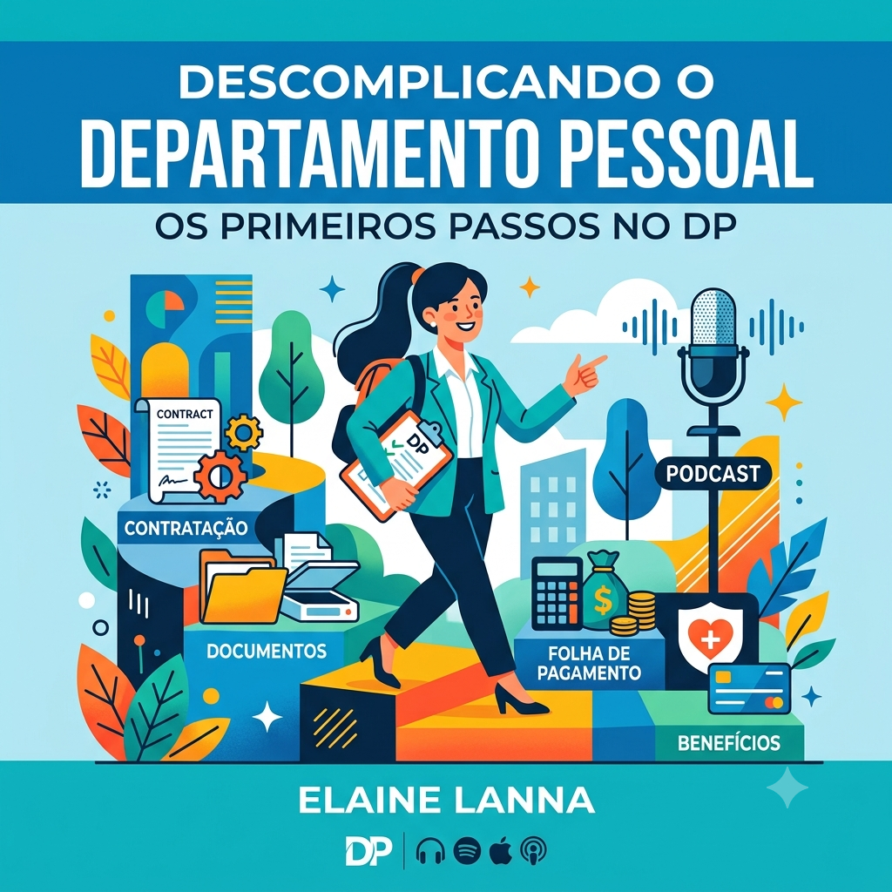

# Dio-Projeto-PodCast-IA
# 🎙️ Descomplicando o Departamento Pessoal: Os Primeiros Passos no DP

  

## 📖 Sobre o Projeto

Este projeto foi desenvolvido como parte do desafio da **DIO**, utilizando ferramentas de Inteligência Artificial para criar um podcast voltado para profissionais iniciantes na área de Departamento Pessoal.

O objetivo foi desenvolver um conteúdo simples, didático e acessível para quem deseja conhecer os primeiros conceitos da profissão.

---

## 🎯 Objetivo

Criar um podcast utilizando Inteligência Artificial para auxiliar na elaboração do roteiro, criação da identidade visual e narração do conteúdo.

---

## 🛠️ Ferramentas Utilizadas

- ChatGPT
- Gemini
- ElevenLabs
- GitHub

---

## 💬 Prompts Utilizados

### ChatGPT

**Criação do tema do podcast**

> Agora você é um roteirista de um Podcast sobre Departamento Pessoal para quem quer começar na carreira.

**Criação do nome da série**

> Dê um nome criativo para a série e um subtítulo, não use termos complicados e jurídicos, fale em uma linguagem para que pessoas leigas no assunto possam entender.

**Criação do título final**

> Faça uma junção dos títulos "Primeiros Passos no DP" e "Descomplicando o Departamento Pessoal", criando um novo título e subtítulo.

**Criação do roteiro**

> Crie o roteiro para o podcast com o título "Descomplicando o Departamento Pessoal: Os Primeiros Passos no DP", sem usar termos complicados, pois é para pessoas iniciantes. Será apresentado apenas por uma pessoa e deve ser curto.

---

### Gemini

**Criação da capa do podcast**

> Crie uma imagem com medida 1x1 para um podcast com o título **"Descomplicando o Departamento Pessoal: Os Primeiros Passos no DP"**, em estilo flat. Pode incluir o meu nome **Elaine Lanna**.

---

### ElevenLabs

Utilizado para gerar a narração do roteiro e produzir o áudio do podcast com voz sintetizada por Inteligência Artificial.

---

## 🎧 Resultado

O resultado foi um episódio introdutório de podcast voltado para profissionais iniciantes, com linguagem simples e acessível, apresentando os conceitos básicos do Departamento Pessoal.

---

## 👩‍💼 Autora

**Elaine Lanna**

- Administradora
- Psicóloga
- Analista de Departamento Pessoal
- Estudante de People Analytics

---

## 📚 Aprendizados

Este projeto permitiu desenvolver habilidades em:

- Engenharia de prompts;
- Criação de conteúdo com IA;
- Produção de roteiro para podcast;
- Geração de imagens com IA;
- Narração utilizando Inteligência Artificial;
- Documentação de projetos no GitHub.
